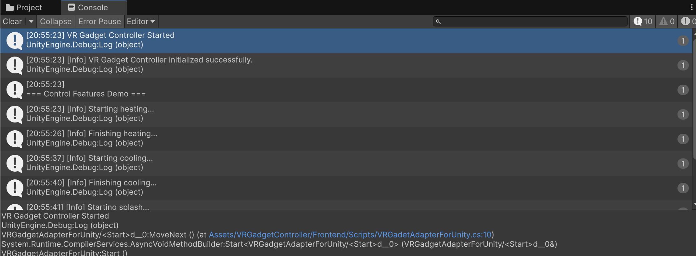

# Unityでの環境構築メモ

## 概要

VRGadgetControllerをUnityから利用するためのセットアップ手順を説明します。

## 1. 必要なパッケージのインストール
[TeslaAPIHandler](https://github.com/makaizo/tesla-api-handler/blob/main/TeslaAPIHandler/Frontend/how_to_setup_unity.md)と同様の手順で、NuGetを用いて以下のパッケージをインストールする。
 - MQTTnet (4.0.2.221)
 - MQTTnet.Extensions.ManagedClient (4.0.2.221)

## 2. ファイルを配置

1. 本環境をコピーしてUnityプロジェクトのAssetsに配置
2. 以下のファイル、フォルダがあるとUnityでビルド失敗するので削除する
    - `VRGadgetController/bin/`
    - `VRGadgetController/obj/`
    - `VRGadgetController/Program.cs`

フォルダ構成の例

```
Assets
├── VRGadgetController      <--- 本環境をコピー
|    ├── Frontend
|    │   ├── how_to_setup_unity.md
|    │   └── ...
|    ├── Services
|    │   └── ...
|    └── ...
├── Packages
├── Scenes
└── ...
```

## 3. スクリプトの配置
`VRGadgetAdapterForUnity.cs`をGameObjectやCube等にアタッチする。

## 4. 動作確認

1. プロジェクトを実行
2. コンソールで以下のようなログが出ていることを確認


